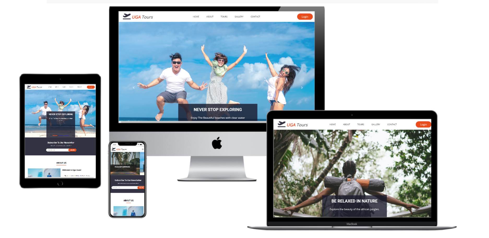
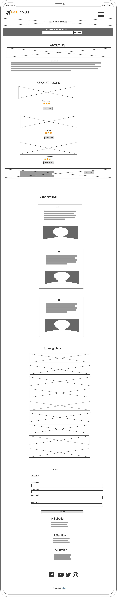
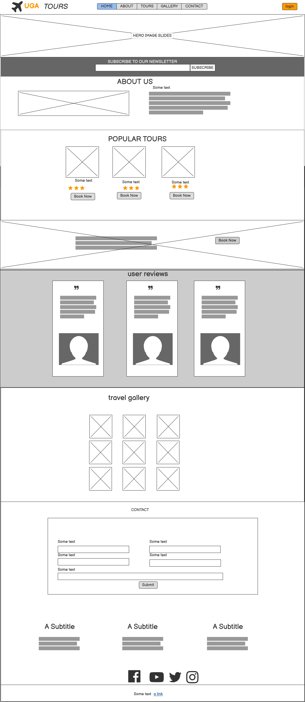

<h1 align="left">UGA TOURS</h1>

 

[View the live project here.](https://atinos31.github.io/UGA_TOURS/)

This is a fictional travel website based in Uganda.IMobile first approach design be  fully responsive and accessible on a range of devices, making it easy to navigate for potential clients.


## Table of contents

1. [**USER_EXPERIENCE**](#user-experience)
    - [**Scope**](#scope)
    - [**Structure**](#structure)
    - [**Skeleton**](#skeleton)
    - [**Surface**](#surface)
    
2. [**Features**](#features)
    - [**Existing features**](#existing-features)
    - [**Features left to implement**](#features-left-to-implement)

3. [**Technologies Used**](#technologies-used)

4. [**Testing**](#testing)
    - [**Testing documentation can be found here in a seperate file**](TESTING.md)

5. [**Deployment**](#deployment)

6. [**Credits**](#credits)
    - [**Content**](#content)
    - [**Resources**](#resources)
    - [**Media**](#media)
    - [**Acknowledgements**](#acknowledgements)

## User Experience (UX)
## 

-   ### User stories

    -   #### First Time Visitor Goals
         a. As a first time visiter, i want to be able to find relevant information fast and navigate easily to find necessary content.
         b. As a first time visitor i want to be able to understand the main role of the website.
         c. As a first time visitor ,i want to check out what users think about the site's services.

    -   #### Returning Visitor Goals

       -  a. As a returning visitor i want to be able to reachout for more information when need.
       -  b. As a returning visitor i want to be able to see the latest offers available.
       -  c. As a returning visitor i want to be able to sign in to the site.
    -   #### Frequent User Goals
       -  a. As a frequent user i want to be able to see latest promotions.
       -  b.  As a frequent User i want to signup to the newsletter so that i am updated about new propositions.

-   ### Design
    -   #### Colour Scheme
      I decided to choose a subtle color scheme, several shades of grey. easy on the eyes with a modern touch.
       - 
       - #182c39 - This grey colour is used for the logo icon, button hover backgrounds, footer background and text-color in the contact section..
       - #4a4a4a -this shade of grey is used in the newsletter subscribe button in its hover state as a background color
       - #e84d1b-This orange colour is used in the login button in the header section,subscribe button in the newsletter section &submit button in the contact section.
       - #f4f4fa -this shade of grey is used in the  user feedback background section.
       - #888888 - this shade of grey is used for the box shadows on the user reviews container and contact container.
       - #fff -white is used for footer fonts and icons, fonts on the promotion section and booking buttons on tours section.
        - #000 - i used black for paragraphs in the about section and for the nav-links
    -   #### Typography
        - 
```html
<link href="https://fonts.googleapis.com/css2?family=Open+Sans&family=Roboto:ital,wght@0,100;0,300;0,700;0,900;1,900&display=swap">
```
    -   #### Imagery
        
       - All images used are from pexels and unsplash.        

*   ### Wireframes

    -   Mobile Wireframe - 

    -   Tablette Wireframe - 

    -   Desktop Wireframe - 

## Features

-   Responsive on all device sizes

-   Interactive elements

## Technologies Used
### Languages Used

-   [HTML5](https://en.wikipedia.org/wiki/HTML5)
-   [CSS3](https://en.wikipedia.org/wiki/Cascading_Style_Sheets)

### Frameworks, Libraries & Programs Used

1. [Bootstrap 4.4.1:](https://getbootstrap.com/docs/4.4/getting-started/introduction/)
    - Bootstrap was used to assist with the responsiveness and styling of the website.
1. [Google Fonts:](https://fonts.google.com/)
    - Google fonts were used to import the 'Titillium Web' font into the style.css file which is used on all pages throughout the project.
1. [Font Awesome:](https://fontawesome.com/)
    - Font Awesome was used on all pages throughout the website to add icons for aesthetic and UX purposes.
1. [hover css](http://ianlunn.github.io/Hover/) for animations.
1. [Git](https://git-scm.com/)
    - Git was used for version control by utilizing the Gitpod terminal to commit to Git and Push to GitHub.
1. [GitHub:](https://github.com/)
    - GitHub is used to store the projects code after being pushed from Git.
1. [Balsamiq:](https://balsamiq.com/)
    - Balsamiq was used to create the [wireframes](https://github.com/) during the design process.

## Testing

The W3C Markup Validator and W3C CSS Validator Services were used to validate every page of the project to ensure there were no syntax errors in the project.

-   [W3C Markup Validator](http://jigsaw.w3.org/css-validator/check/referer (for HTML/XML document only)) - [passed Results](https://validator.w3.org/nu/#textarea)
-   
-   [W3C CSS Validator](http://jigsaw.w3.org/css-validator/check/referer (for HTML/XML document only)) - [Results](https://github.com/)

### Testing User Stories from User Experience (UX) Section
   1- [lighthouse](https://8000-e34cea04-5547-4052-93ef-dd92f5994742.ws-eu03.gitpod.io/assets/#contact)
    testing to improve perfomance, accesibility, SEO and best practices.

     

### Further Testing

-   The Website was tested on Google Chrome, Internet Explorer, Microsoft Edge and Safari browsers.
-   The website was viewed on a variety of devices such as Desktop, Laptop, tablette,iPhone6/7/8 & iPhoneX.
-   Friends and family members were asked to review the site and documentation to point out any bugs and/or user experience issues.

### Known Bugs
-unused css files making the site's perfomance slower.
- footer elements all sqeezed in together.
had to add in some padding to space them eaqually.
- issue with color contrast. 
- hover on images, blocks out some content- had to use hover-css and change the class.
-issue with open tags not being closed thereby misaligment of content.
- on mobile screen navigation menu opens on top on slider images.. due to class fixed-top.(changed fixed-top to sticky-top)

## Deployment

### GitHub Pages

The project was deployed to GitHub Pages using the following steps...

1. Log in to GitHub and locate the [GitHub Repository](https://github.com/)
2. At the top of the Repository (not top of page), locate the "Settings" Button on the menu.
    - Alternatively Click [Here](https://raw.githubusercontent.com/) for a GIF demonstrating the process starting from Step 2.
3. Scroll down the Settings page until you locate the "GitHub Pages" Section.
4. Under "Source", click the dropdown called "None" and select "Master Branch".
5. The page will automatically refresh.
6. Scroll back down through the page to locate the now published site [link](https://github.com) in the "GitHub Pages" section.

### Forking the GitHub Repository

By forking the GitHub Repository we make a copy of the original repository on our GitHub account to view and/or make changes without affecting the original repository by using the following steps...

1. Log in to GitHub and locate the [GitHub Repository](https://github.com/)
2. At the top of the Repository (not top of page) just above the "Settings" Button on the menu, locate the "Fork" Button.
3. You should now have a copy of the original repository in your GitHub account.

### Making a Local Clone

1. Log in to GitHub and locate the [GitHub Repository](https://github.com/)
2. Under the repository name, click "Clone or download".
3. To clone the repository using HTTPS, under "Clone with HTTPS", copy the link.
4. Open Git Bash
5. Change the current working directory to the location where you want the cloned directory to be made.
6. Type `git clone`, and then paste the URL you copied in Step 3.

```
$ git clone https://github.com/YOUR-USERNAME/YOUR-REPOSITORY
```

7. Press Enter. Your local clone will be created.

```
$ git clone https://github.com/YOUR-USERNAME/YOUR-REPOSITORY
> Cloning into `CI-Clone`...
> remote: Counting objects: 10, done.
> remote: Compressing objects: 100% (8/8), done.
> remove: Total 10 (delta 1), reused 10 (delta 1)
> Unpacking objects: 100% (10/10), done.
```

Click [Here](https://help.github.com/en/github/creating-cloning-and-archiving-repositories/cloning-a-repository#cloning-a-repository-to-github-desktop) to retrieve pictures for some of the buttons and more detailed explanations of the above process.

## Credits

### Code
-   [CSS tricks](https://css-tricks.com/)

-    [W3schhool](https://www.w3schools.com/default.asp)

-    [StackOverflow posts](https://stackoverflow.com)

-   [Bootstrap4](https://getbootstrap.com/docs/4.4/getting-started/introduction/): Bootstrap Library used throughout the project mainly to make site responsive using the Bootstrap Grid System.


### Content

-   All content was written by the developer.

### Media

-   images are from pexels and unsplash.

### Acknowledgements

-   My Mentor for continuous helpful feedback.
-   Full stack Wattsapp group
-  Tutor support
-  Slack

