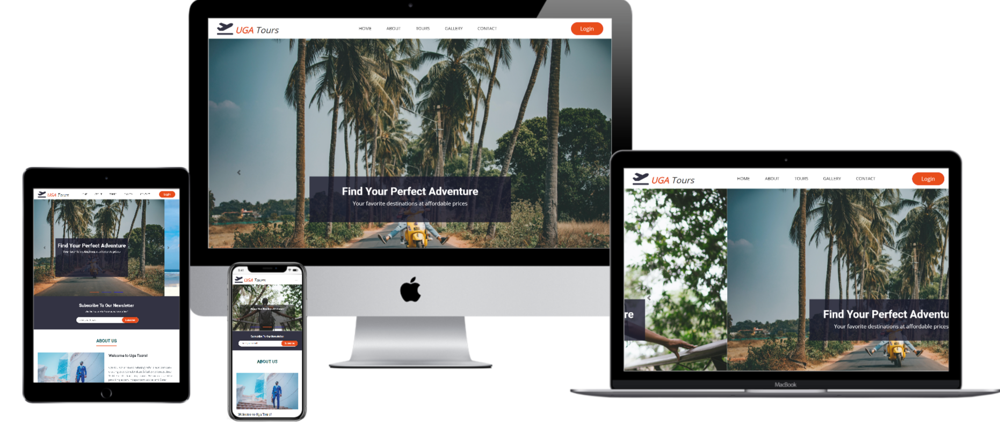
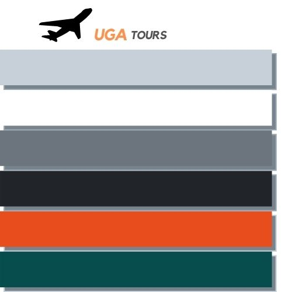
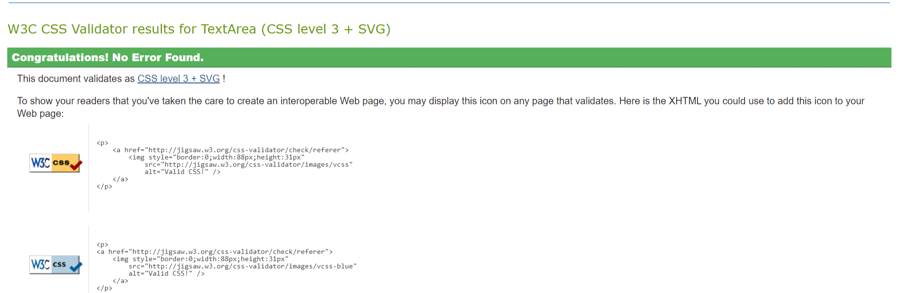

<h1 align="left">UGA TOURS</h1>
User-Centric  Frontend Development Milestone Project.



## [View the live project here.](https://atinos31.github.io/UGA_TOURS/)
---
This is a fictional travel website based in Uganda.Mobile first approach design  to be  fully responsive and accessible on a range of devices, making it easy to navigate for potential clients.


# Table of contents

- [UX](#ux)
  - [Website Owner Business goals](#website-owner-business-goals)
  - [User Goals](#user-goals)
     - [New User Goals](#new-user-goals)
     - [Returning visiter Goals](#returning-visitor-goals)
     - [Website Owner Business Goals](#website-owner-business-goals)
   - [User Stories](#user-stories)
   - [Website Structure](#website-structure)
   - [Wireframes](#wireframes)
   - [Surface](#surface)
- [Features](#features)
- [Technology](#technology)
- [Testing](#testing)
    - [Fuctionality](#functionality)
    - [Compartibility](#compartibility)
    - [Code Validation](#code-validation)
    - [User Stories Testing](#user-stories-testing)
    - [Known Bugs](#known-bugs)
    - [Perfomance Testing](#performance-testing)
- [Deployment](#deployment)
- [Credits](#credits)
- [Aknowledgements](#aknowledgements)

# UX

## Website Owner Business Goals
- The main reason of creating this website is to help present tour services to the tourist all over the globe interested in exploring Africa.
- Users can find information about the tours available.
- Users can look at the images of the destinations possible.
- Users contact the agency through email and phone number.
- Users can subscribe for the newsletter to learn about seasonal offers.

## User Goals

### New User Goals
- As a first time visiter, i want to be able to find relevant information fast and navigate easily to find necessary content.
- As a first time visitor i want to be able to understand the main role of the website.
- As a first time visitor ,i want to check out what users think about the site's services.

### Returning User Goals
- As a returning visitor i want to be able to reachout for more information when need.
- As a returning visitor i want to be able to see the latest offers available.
- As a returning visitor i want to be able to sign in to the site.

### Frequent User Goals
- As a frequent user i want to be able to see latest promotions.
- As a frequent User i want to signup to the newsletter so that i am updated about new propositions.

## Website Structure
  - The website is designed to be easy to navigate and user friendly on all device types.
  - Users can  can easily interact  using the buttons and links .
  - Users can easily reach out to the the agency incase they need more info about the tours.

## Wireframes
I used balsamiq to create the wireframes. 
> there are some slight changes on the real site to improve the user experience
- 

- 

- 
- 

## Surface

 #### Colour Scheme

I decided to choose a subtle color scheme, several shades of grey. easy on the eyes with a modern touch.
* #182c39 - This grey colour is used for the logo icon, button hover backgrounds, footer background and text-color in the contact section..
* #4a4a4a -this shade of grey is used in the newsletter subscribe button in its hover state as a background color
* #e84d1b-This orange colour is used in the login button in the header section,subscribe button in the newsletter section &submit button in the contact section.
* #f4f4fa -this shade of grey is used in the  user feedback background section and navbar background.
* #084d4d - this teal color is used in the headings.
* #888888 - this shade of grey is used for the box shadows on the user reviews container and contact container.
* #fff -white is used for footer fonts and icons, fonts on the promotion section and booking buttons on tours section.
* #000 - i used black  for the nav-links

## Fonts
 * fonts used are Roboto for headings and Open sans for paragraghs.
        - 
```html
<link href="https://fonts.googleapis.com/css2?family=Open+Sans&family=Roboto:ital,wght@0,100;0,300;0,700;0,900;1,900&display=swap">
```

### Images
 I used images from [unsplash](https://unsplash.com/) and [pexels](https://www.pexels.com/fr-fr/chercher/bunji%20jump/) and are credited in the [credits](#credits) section.


# Features
   - This is a one page website consisting of 5 sections and all are accessible from the navigation menu.
   - There is a pop up sign in page once the login button is clicked. this shall be fully implemeted in the future.

## Navigation Bar 
* #### The Navigation bar set to sticky position is visible at the top for each section, Its fully responsive and changes to a humburger menu once on mobile devices.
* Navigation Scheme On the left side there is a logo and it can be used a nav link to the home section.
* In the center there are 5 links (burger-menu too on mobile its positioned right) and they contain:
  * home
  * about
  * tours
  * gallery
  * contact
* On The right side there is a login button( for large screens otherwise it aligns vertically on mobile with the nav links).

## Footer
 The footer is positioned at the bottom of the page and it contains:
  * quick links
  * contact
  * map

## home 
 * slider section consist of three slider images and persuasive heading and paragragh.

## about
 * about section consist of image of the company executive and a paragragh giving information about the company.

## newsletter
 * the newsletter section is for clients who would want to be updated about new offers.

## tours
  * the tours section consist of popular tour photos, price, ratings and a booking button. 

## promotion
 * the site provides attractive undeniable offers to it clients.

## reviews
 * the review section consist of user reviews names, and photos of previous reviewers.. this instills trust in new clients.

## gallery
* in this section, we find photos of previous tours.option for what a client may expect.

## contact
 * in the contact section a client may reach out to the agency incase they need more detailed information about the tours.

## Future implementation
  * animated burger menu for small devices.
  * more back end functionality(buttons lead to somewhere).
  * blog section/community of travellers
  * pop up chat window for easy communication between client and the agency.
  * travel ads video
  * sign up button
  * pop up promotion offers.

## Technologies Used
### Languages Used

- [HTML5](https://en.wikipedia.org/wiki/HTML5)
- [CSS3](https://en.wikipedia.org/wiki/Cascading_Style_Sheets)

### Frameworks, Libraries & Programs Used

1. [Bootstrap 4.4.1:](https://getbootstrap.com/docs/4.4/getting-started/introduction/)
    - Bootstrap was used to assist with the responsiveness and styling of the website.
1. [Google Fonts:](https://fonts.google.com/)
    - Google fonts were used to import the 'Titillium Web' font into the style.css file which is used on all pages throughout the project.
1. [Font Awesome:](https://fontawesome.com/)
    - Font Awesome was used on all pages throughout the website to add icons for aesthetic and UX purposes.
1. [hover css](http://ianlunn.github.io/Hover/) for animations.
1. [Git](https://git-scm.com/)
    - Git was used for version control by utilizing the Gitpod terminal to commit to Git and Push to GitHub.
1. [GitHub:](https://github.com/)
    - GitHub is used to store the projects code after being pushed from Git.
1. [Balsamiq:](https://balsamiq.com/)
    - Balsamiq was used to create the [wireframes](https://github.com/) during the design process.
1. [canva](https://www.canva.com/)
    - Canva was used to create the color scheme.


# Testing

## Code Validation
The W3C Markup Validator and W3C CSS Validator Services were used to validate every page of the project to ensure there were no syntax errors in the project.

-   [W3C Jigsaw html validator](http://jigsaw.w3.org/css-validator/check/referer (for HTML/XML document only)) - [passed Results](https://validator.w3.org/nu/#textarea) 
-   [W3C CSS Validator](http://jigsaw.w3.org/css-validator/check/referer (for HTML/XML document only)) - 

### Performance Testing
   - I ran [lighthouse](https://developers.google.com/web/tools/lighthouse/) tool to check for performance, accesibility, SEO and best paractices.
   * i had to make certain changes to improve on it ,#bugs known section.

     

### Further Testing

-   The Website was tested on Google Chrome.
-   The website was viewed on a variety of devices such as Desktop, Laptop, Surface Duo,Moto G4,iPhone6/7/8 & iPhoneX .
-   Friends and family members were asked to review the site and documentation to point out any bugs and/or user experience issues.

### Known Bugs
- unused css files making the site's perfomance slower.
- footer elements all sqeezed in together, had to add in some padding to space them eaqually.
- issue with color contrast. 
- hover on images, blocks out some content- had to use hover-css and change the class.
- issue with open tags not being closed thereby misaligment of content.
- on mobile screen navigation menu opens on top on slider images.. due to class fixed-top.(changed fixed-top to sticky-top)
- over lay text on slider images not well balanced ..i had to used media queries.
- footer a links opening on the same page... i had to fix the target blank attribute.
- further issues with positioning and padding.
- on performance issues i had to include some links at the head of html to improve its performance.
- image sizes were too big thereby needed to be compressed for faster loading speed and resizing them.
- footer had some white space below, fixed it with > bottom: 150px; and position:absolute;
- too much white space between sections - fixed with less margin-top.
- issues with too much white space  and overflowing submit button in contact section as observed by my mentor - i had to reduce on the padding and margins ,then for the submit button, i had to remove the width attribute.-
- subscribe button in the newsletter section ,not responsive
# Deployment

### GitHub Pages

The project was deployed to GitHub Pages using the following steps...

1. Log in to GitHub and locate the [UGA_TOURS](https://github.com/Atinos31/UGA_TOURS)
2. At the top of the Repository (not top of page), locate the "Settings" Button on the menu.
3. Scroll down the Settings page until you locate the "GitHub Pages" Section.
4. Under "Source", click the dropdown called "None" and select "Master Branch".
5. The page will automatically refresh.
6. Scroll back down through the page to locate the now published site [link](https://atinos31.github.io/UGA_TOURS/) in the "GitHub Pages" section.

### Forking the GitHub Repository

By forking the GitHub Repository we make a copy of the original repository on our GitHub account to view and/or make changes without affecting the original repository by using the following steps...

1. Log in to GitHub and locate the [UGA_TOURS](https://github.com/Atinos31/UGA_TOURS)
2. At the top of the Repository (not top of page) just above the "Settings" Button on the menu, locate the "Fork" Button.
3. You should now have a copy of the original repository in your GitHub account.

### Making a Local Clone

1. Log in to GitHub and locate the [UGA_TOURS](https://github.com/Atinos31/UGA_TOURS)
2. Under the repository name, click "Clone or download".
3. To clone the repository using HTTPS, under "Clone with HTTPS", copy the link.
4. Open Git Bash
5. Change the current working directory to the location where you want the cloned directory to be made.
6. Type `git clone`, and then paste the URL you copied in Step 3.

```
$ git clone https://github.com/YOUR-USERNAME/YOUR-REPOSITORY
```

7. Press Enter. Your local clone will be created.

```
$ git clone https://github.com/YOUR-USERNAME/YOUR-REPOSITORY
> Cloning into `CI-Clone`...
> remote: Counting objects: 10, done.
> remote: Compressing objects: 100% (8/8), done.
> remove: Total 10 (delta 1), reused 10 (delta 1)
> Unpacking objects: 100% (10/10), done.
```

Click [Here](https://help.github.com/en/github/creating-cloning-and-archiving-repositories/cloning-a-repository#cloning-a-repository-to-github-desktop) to retrieve pictures for some of the buttons and more detailed explanations of the above process.

## Credits
 
 * I used code institute student templateto begin this project[gitpod full template](https://github.com/Code-Institute-Org/gitpod-full-template)

### Code
-   [CSS tricks](https://css-tricks.com/)

-    [W3schhool](https://www.w3schools.com/default.asp)

-    [StackOverflow posts](https://stackoverflow.com)

-   [Bootstrap4](https://getbootstrap.com/docs/4.4/getting-started/introduction/): Bootstrap Library used throughout the project mainly to make site responsive using the Bootstrap Grid System.

- [MDN WEB DOCS](https://developer.mozilla.org/)

### Acknowledgements

-   My Mentor for continuous helpful feedback.
-   Full stack Wattsapp group for the positive feeback and encouragement.
-  Tutor support for solving techincal issues with gitpod.
-  Slack for always having an answer when i needed it.

